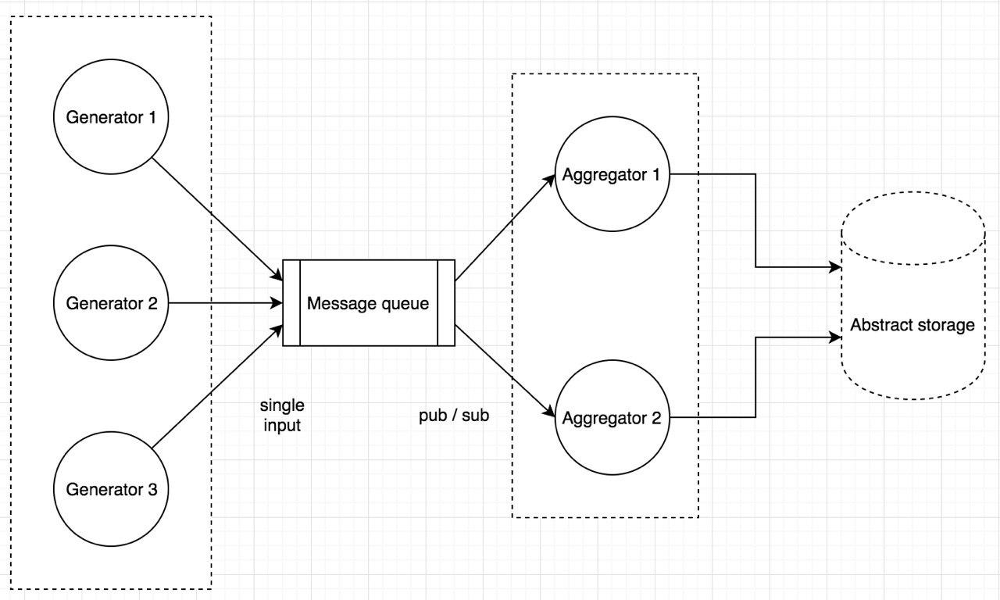

## Queue test task

attempt to implement  
  
[description](./docs/task.md)

### Run
`go build`  
`./queue_test_task --config <config_file>`  

### Run in Docker
`CONFIG=<abs_path_to_config> make run`  
or  
`CONFIG=<abs_path_to_config> DEST=<abs_path_to_dir> make run`  
choose the latter to map the output directory to `DEST` 
if storage type is 1 in the config. program output will be in
file `data.txt`
stop gracefully with `make stop`
CTRL-C will stop execution gracefully, but return exit code 130

### Implementation notes
- Unfortunately, it's rather a pipeline than a pub/sub broker. Got drivern away by
writing a generator that sends values if queue is available any time within its sending period  
_TODO_: queue should `publish` or return error.

- Queue is based on a buffered channel. It discards data without a subscriber, but stalls if
subscriber stalls. Reason: straightforward compliance with size restriction.  
_TODO_: queue should either maintain multiple inbound channels instead of a single buffered chan
or consume values to a synchronized data structure
and fan them out to subscribers via channels